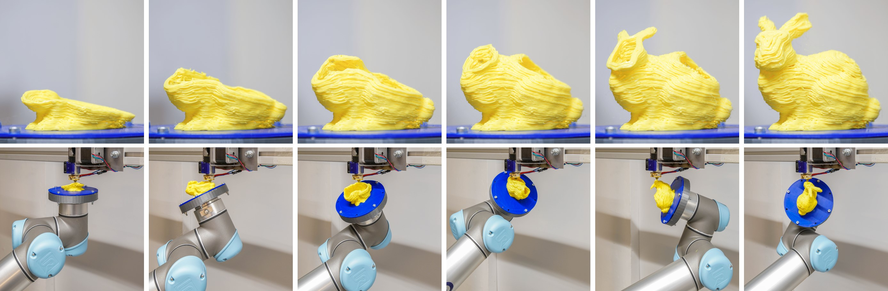
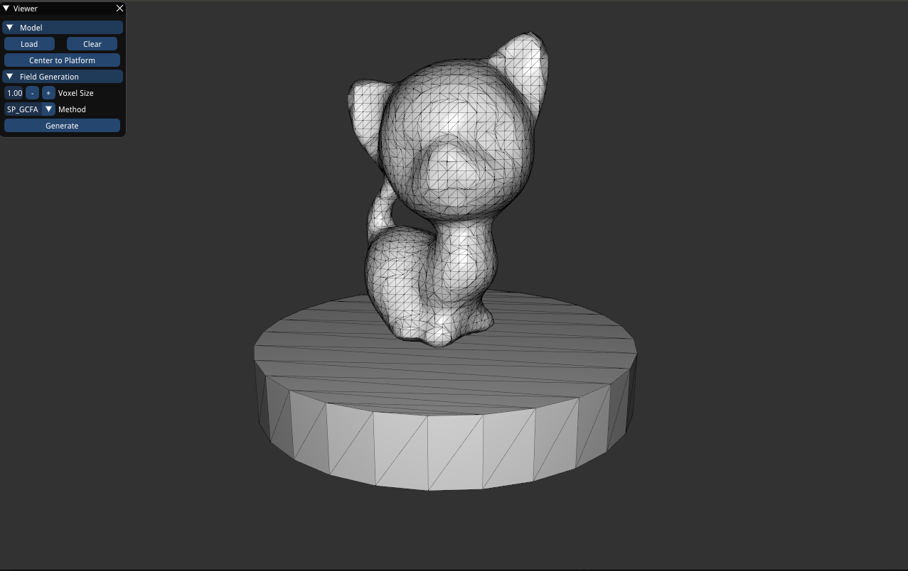
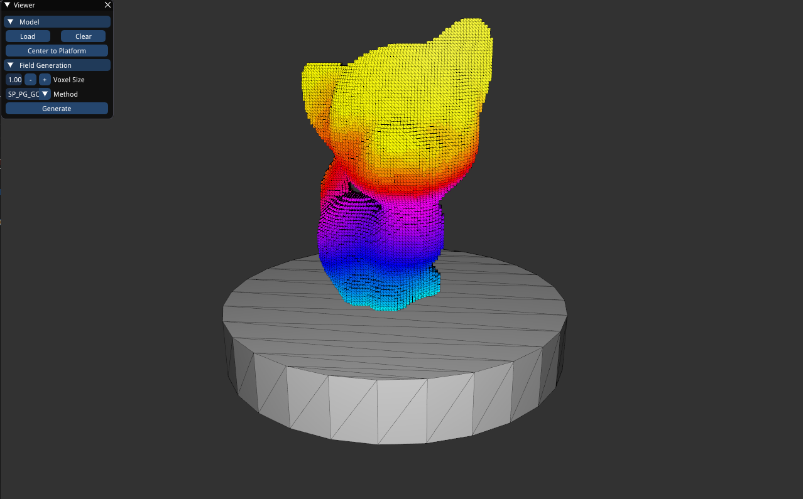
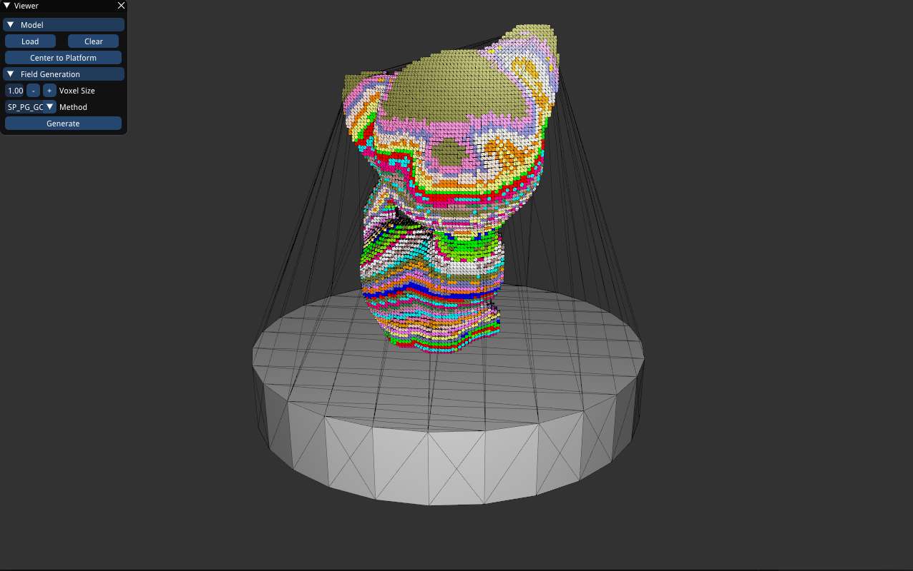
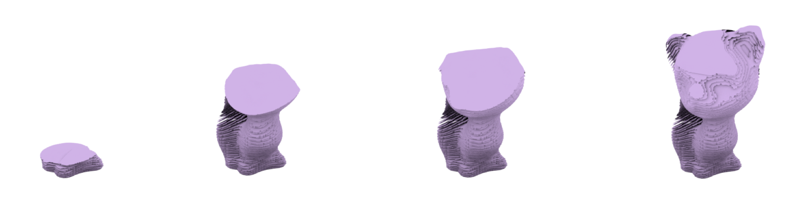

## Under Construction :hammer: :hammer: :hammer:

# Support-free volume printing by multi-axis motion



[Chengkai Dai](https://github.com/daichengkai/), 
[Charlie C.L. Wang](http://www.mae.cuhk.edu.hk/~cwang/), 
[Chenming Wu](https://github.com/wucm1994/), 
[Sylvain Lefebvre](http://www.antexel.com/sylefeb/research/), 
[Guoxin Fang](https://scholar.google.com/citations?user=Jk_ARxcAAAAJ&hl=en),
[Yongjin Liu](https://cg.cs.tsinghua.edu.cn/people/~Yongjin/Yongjin.htm/)

*ACM Transactions on Graphics (Proceedings of SIGGRAPH 2018), 37, 4, 2018*

## Abstract

This paper presents a new method to fabricate 3D models on a robotic printing system equipped with multi-axis motion. Materials are accumulated inside the volume along curved tool-paths so that the need of supporting structures can be tremendously reduced - if not completely abandoned - on all models. Our strategy to tackle the challenge of tool-path planning for multi-axis 3D printing is to perform two successive decompositions, first volume-to-surfaces and then surfaces-to-curves. The volume-to-surfaces decomposition is achieved by optimizing for a scalar field within the volume that represents the fabrication sequence. The field is constrained such that its iso-values represent curved layers that are supported from below, and present a convex surface affording for collision-free navigation of the printer head. After extracting all curved layers, the surfaces-to-curves decomposition covers them with tool-paths while taking into account constraints from the robotic deposition system. Our method successfully generates tool-paths for 3D printing models with large overhangs and high-genus topology. We fabricated several challenging cases on our robotic platform to verify and demonstrate its capabilities. 

**To see more details, please refer to our [paper](http://www.mae.cuhk.edu.hk/~cwang/pubs/SIG18RobotVolPrint.pdf) and [video@Youtube](https://www.youtube.com/watch?v=iaZeTlios0w&feature=youtu.be). 

## Dependency
- [libigl](https://libigl.github.io/)
- [qhull](http://www.qhull.org/)

## Installation
- Clone this repository:

        git clone https://github.com/daichengkai/VoxelMultiAxisAM

- Set libigl directory in CMake/FindLIBIGL.cmake.

- Set qhull directory in CMakeLists.txt line 7.

- Compiling.

        mkdir build
        cd build
        cmake -DLIBIGL_WITH_CGAL=ON ../
        make

## Usage

## Accumulation Field Generation

1. Open program ./VoxelMultiAxisAM .

2. Load mesh model and center to printing platform.



3. Set voxel size according to nozzle size.

4. Select growing method. 

5. Generate field.



You can check each voxel layer by pressing key "=" and "-"




## Surface Layer Generation

Press Contouring button and the surface meshes will be saved into layers folder.

Here shows an example,




## Tool-path Planning

**Coming soon !!!**


## License

VoxelMultiAxisAM is published under the Lesser GNU Public License (LGPL). That means that you can link it from a program with whatever license you choose. Also, you can modify and redistribute the library, but you must provide the source code for the modified version.

## BibTex 

We would be grateful if scientific publications resulting from projects that make use of VoxelMultiAxisAM would cite our work.

```
@article{Dai:2018:MultiAxisAM,
 author = {Dai, Chengkai and Wang, Charlie C. L. and Wu, Chenming and Lefebvre, Sylvain and Fang, Guoxin and Liu, Yong-Jin},
 title = {Support-free Volume Printing by Multi-axis Motion},
 journal = {ACM Trans. Graph.},
 issue_date = {August 2018},
 volume = {37},
 number = {4},
 month = {july},
 acmid = {3201342},
 publisher = {ACM},
 address = {New York, NY, USA},
} 
```